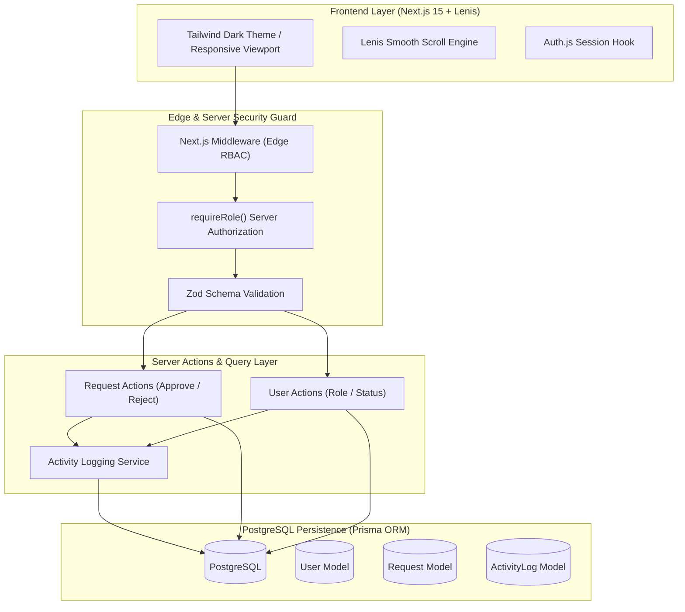

# Nova Desk — Modern IT Equipment & Access Request Platform

A sleek, enterprise-grade IT request and workflow authorization platform built with **Next.js 15 (App Router)**, **TypeScript**, **PostgreSQL**, **Prisma ORM**, **Auth.js (v5)**, **Tailwind CSS**, and **Lenis Smooth Scrolling**.

Designed for high-velocity engineering and operations teams to streamline hardware allocations, software licensing, and cloud access requests with role-based approvals and an immutable compliance audit trail.

---

## 🌟 Key Features

- **Linear-Inspired Dark UI**: Modern dark theme with ambient glowing accents, subtle grid patterns, glassmorphism panels, and refined typography.
- **Lenis Smooth Scrolling**: Fluid, momentum-based scrolling with accessibility-aware reduced motion fallback.
- **Strict Role-Based Access Control (RBAC)**:
  - **Employee (`USER`)**: Submit equipment/software requests, monitor real-time review status, track personal history.
  - **Engineering Lead (`MANAGER`)**: Real-time sign-off queue, budget validation, append approval notes, 1-click approvals/rejections.
  - **IT Operations (`ADMIN`)**: Full governance, user provisioning, role promotion, account lifecycle management, and global audit ledger.
- **Immutable Compliance Audit Trail**: Automated database logging for every authentication event, status transition, and role mutation.
- **Edge & Server-Side Security**: Multi-tier defense via Next.js middleware, server-side session verification (`requireRole`), and Zod input validation schemas.
- **Docker & Home Server Ready**: Production multi-stage Dockerfile and Docker Compose setup for deployment on home servers, NAS, or cloud VPS.

---

## 🏗️ Architecture



---

## 👥 Accounts & Roles

| Account | Email | Password | Role | Responsibilities |
| :--- | :--- | :--- | :--- | :--- |
| **System Administrator** | `admin@example.com` | `Admin123!` | `ADMIN` | IT fleet management, user provisioning, role promotion, full compliance audit log |
| **Engineering Manager** | `manager@example.com` | `Manager123!` | `MANAGER` | Team queue triage, hardware/SaaS budget sign-offs, approvals & rejections |
| **Staff Engineer** | `user@example.com` | `User123!` | `USER` | Equipment, monitor, and SaaS license requests |

---

## 🚀 Quick Start (Local Development)

### Prerequisites
- Node.js `>= 18.0.0`
- npm `>= 9.0.0`

### 1. Install Dependencies
```bash
npm install
```

### 2. Initialize Database & Seed Sample Records
```bash
npm run prisma:generate
npx tsx scripts/setup-db.ts
```

### 3. Run Automated E2E Verification Suite
```bash
npx tsx scripts/test-e2e.ts
```

### 4. Start Development Server
```bash
npm run dev
```
Open [http://localhost:3000](http://localhost:3000) in your browser.

---

## 🐳 Docker & Home Server Deployment

Nova Desk is optimized for self-hosting on home servers, Unraid, TrueNAS, Synology, Proxmox, or Raspberry Pi 4/5.

### 1. Copy Environment Configuration
```bash
cp .env.example .env
```

### 2. Launch with Docker Compose
```bash
docker compose up -d --build
```

### 3. Monitor Logs & Health
```bash
docker compose logs -f novadesk
```

For full reverse proxy configurations (Caddy, Nginx, Cloudflare Tunnels) and backup strategies, see [DEPLOYMENT.md](file:///home/radz/Projects/SaaSRBAC/DEPLOYMENT.md).

---

## 🛠️ Tech Stack

- **Framework**: Next.js 15 (App Router, Server Actions)
- **Language**: TypeScript 5 (Strict mode)
- **Database**: PostgreSQL with Prisma ORM 7
- **Authentication**: Auth.js (NextAuth v5) with JWT session cookies
- **Smooth Scrolling**: Lenis (`lenis`)
- **Styling**: Tailwind CSS
- **Icons**: Lucide React
- **Validation**: Zod
- **Containerization**: Docker & Docker Compose

---

## 🔒 Security & Data Integrity

- **Server-Side Authorization**: Every state mutation verifies session role permissions on the server before execution.
- **SQL Injection & XSS Prevention**: Parameterized queries via Prisma ORM and sanitized React DOM rendering.
- **Hashed Credentials**: Passwords salted and hashed with `bcryptjs` (10 rounds).
- **Audit Immutability**: All approvals, rejections, user promotions, and account deactivations generate append-only log records.

---

## 📄 License

MIT License. Designed and crafted for production reliability and seamless client delivery.
